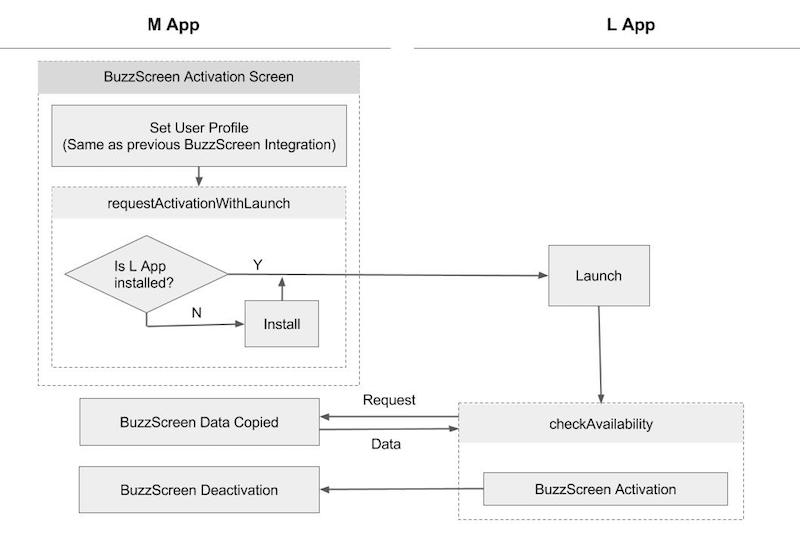

## M앱 마이그레이션 구현

참고 샘플 : **`sample_main_light`**


### 1. `build.gradle` 설정

#### `manifestPlaceholders` 추가

```groovy
android {
    defaultConfig {
        // my_app_key 에는 버즈스크린 연동시 발급받은 앱키를 입력합니다.
        manifestPlaceholders = [buzzScreenAppKey:"my_app_key"]
    }
}
```

#### `dependencies` 에 추가
M앱을 위한 마이그레이션 라이브러리를 추가하고, 버즈스크린 버전 1.6.1이상으로 업데이트해야 합니다.
> 버즈스크린 버전이 `1.+` 인 경우는 자동으로 업데이트되기 때문에 추가작업이 필요없지만, 특정 버전으로 지정된 경우는 반드시 1.6.1 버전 이상으로 지정 필요.

```groovy
dependencies {
    
    // 기존 버즈스크린 연동
    compile 'com.buzzvil:buzzscreen:1.+'
    
    // M앱을 위한 마이그레이션 라이브러리. L앱과 다름에 주의!
    compile 'com.buzzvil.buzzscreen.ext:migration-host:0.9.1'
}
```


### 2. Application Class 에 코드 추가
기존 버즈스크린 연동을 위해 추가한 `BuzzScreen.init` 다음에 `MigrationHost.init`를 호출합니다.

- `MigrationHost.init(Context context, String lockScreenPackageName)`

    마이그레이션을 위한 M앱의 초기화 코드

    **Parameters**
    - `context` : Application context 를 `this` 로 전달
    - `lockScreenPackageName` : L앱의 패키지명

**사용 예시**

```java
public class App extends Application {

    @Override
    public void onCreate() {
        super.onCreate();
        // 기존 버즈스크린 초기화 코드.
        BuzzScreen.init("app_key", this, CustomLockerActivity.class, R.drawable.image_on_fail);

        // 마이그레이션을 위한 코드
        // L앱의 패키지명이 com.buzzvil.buzzscreen.sample_lock_light 인 경우 사용 예시
        MigrationFrom.init(this, "com.buzzvil.buzzscreen.sample_lock_light");
    }
}

```


### 3. 버즈스크린 활성화/비활성화 관련 코드 제거
잠금화면 활성화/비활성화를 위해 삽입했던 `BuzzScreen.getInstance().activate()`, `BuzzSscreen.getInstance().deactivate()`를 제거합니다. 단, 잠금화면에서 바로 잠금화면 비활성화를 제공하는 경우에는 해당 `BuzzScreen.getInstance().deactivate()` 호출만 제거하지 않습니다.
> 마이그레이션 SDK 연동 이후에는 마이그레이션 SDK에서 M앱의 버즈스크린 라이프사이클이 자동으로 관리되고, 유저경험을 위해 잠금화면에서만 잠금화면 비활성화 버튼을 제공하게 됩니다.


### 4. 잠금화면 활성화 화면 변경
앱내의 잠금화면 활성화 화면에서 활성화/비활성화를 설정하는 스위치를 배너 형태로 변경합니다. 그리고 해당 배너 클릭시 다음 함수를 호출합니다.
> M앱이 마이그레이션을 지원하는 버전이 되면 이 배너가 L앱으로 마이그레이션을 수행하는 하나의 채널이 됩니다.

- `MigrationHost.requestActivationWithLaunch()`

    L앱을 통해 잠금화면을 활성화합니다. L앱이 설치안된 경우 마켓을 통해 설치후 자동으로 활성화되고, L앱이 설치된 경우 L앱을 실행하면서 자동으로 잠금화면이 활성화됩니다.
    > `MigrationHost.requestActivationWithLaunch()` 을 호출하기 전에도 이전 버즈스크린 연동처럼 `BuzzScreen.getInstance().getUserProfile()`를 통해 [유저 정보 설정](https://github.com/Buzzvil/buzzscreen-sdk-publisher#2-%EC%9C%A0%EC%A0%80-%EC%A0%95%EB%B3%B4-%EC%84%A4%EC%A0%95)하는 코드는 미리 호출되어야 합니다. 이 정보를 그대로 L앱에서 활용하여 잠금화면이 활성화됩니다.  

#### L앱 잠금화면 활성화 흐름



### 5. L앱을 위한 함수

- `MigrationHost.isLockScreenAppActivated()`

    L앱에서 잠금화면이 활성화되어 있으면 `ture`, 비활성화되어 있으면 `false`를 리턴합니다.

- `MigrationHost.requestDeactivation()`

    L앱에서 잠금화면이 활성화되어 있는 경우 해당 잠금화면을 비활성화합니다.


### [L앱 마이그레이션 구현하러 가기](LIGHT-MIGRATION-L.md)